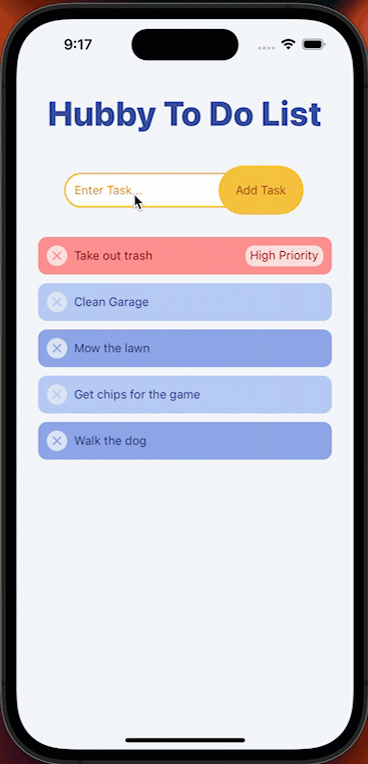
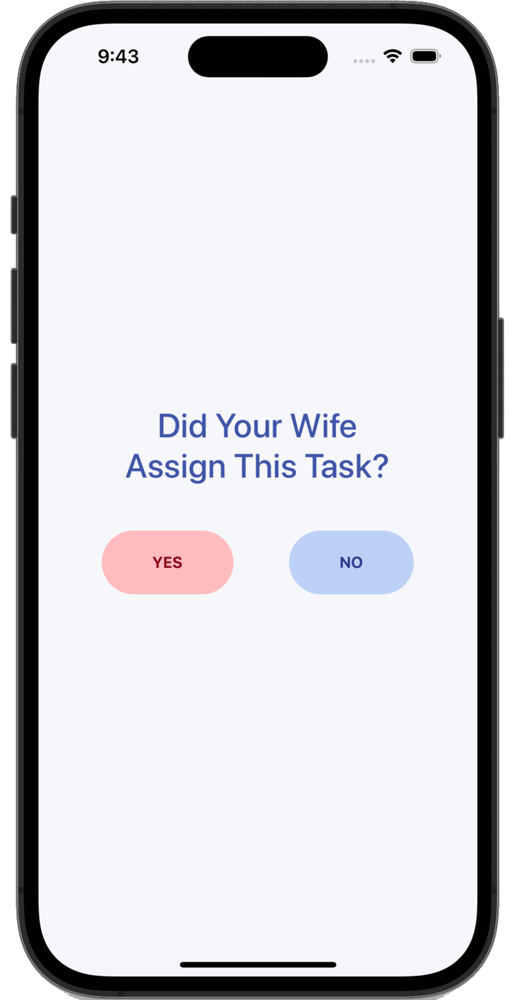
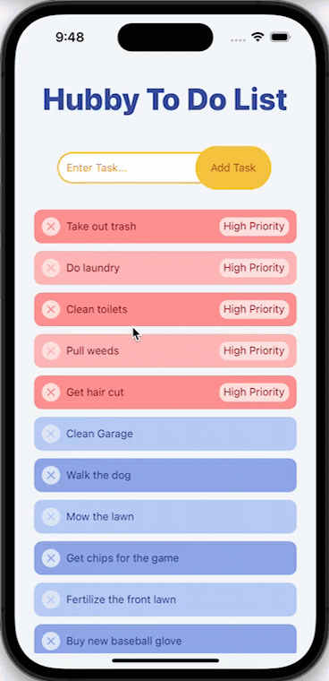
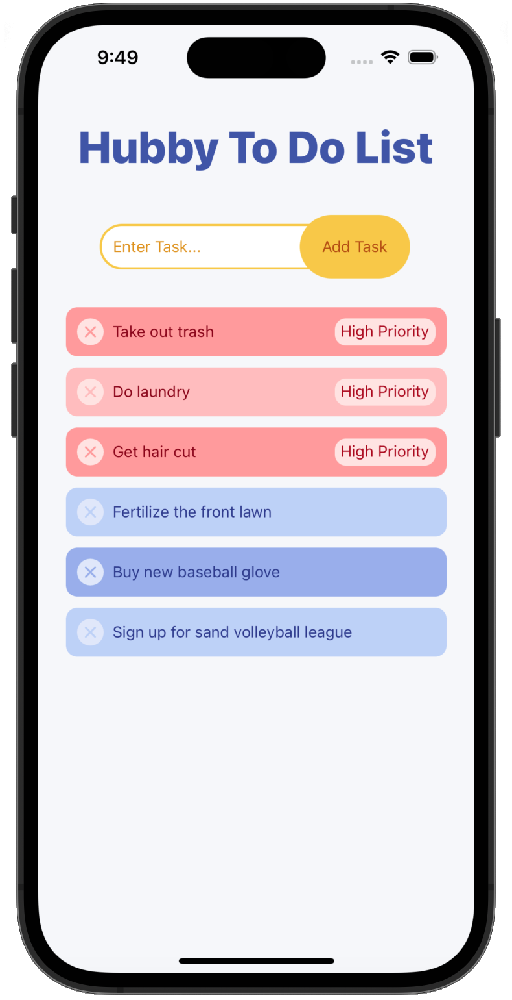

# Hubby To Do List

A simple fun "to do" app that will prioritize any tasks given to you by your wife. As they say... "Happy wife, happy life."

 

   

## Technologies
- React Native

## Features

- <strong>Ability to prioritize tasks given by your wife</strong> - User will be able to mark if the task was given by their wife. If so, tasks will be highlighted in red, given a "high priority" label, and moved to the top of the list.

   
  

 
- <strong>Scrollable list prioritizing performance</strong> - Displayed list will not render items off screen until needed for improved performance.

   
  

 
- <strong>Ability to delete tasks</strong> - User can "click" on the "x" icon to delete a task once complete.

   
  

 
- <strong>Easy of use</strong> - Simple design with clear visuals for ease of use.

## Creator and Designer
Duke Romkey

